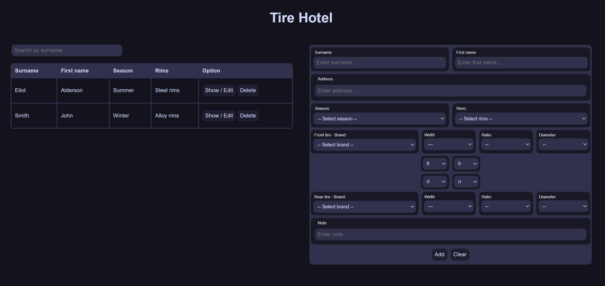
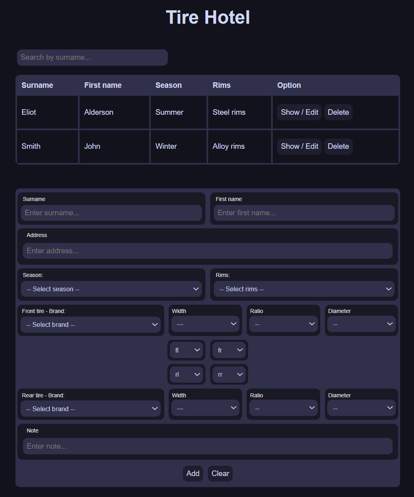

# Tire Hotel 🛞🏡

**Tire Hotel** is a local web application for managing seasonal wheel storage (e.g., summer/winter tires) for automotive workshops or garages.

The system allows you to store detailed customer and tire information, such as:
- Customer name and address
- Season (e.g., Winter/Summer)
- Type of rims
- Tire brand, size, and wear (per wheel)
- Notes for recording the storage location of the customer’s tires.

## 💡 Concept

The idea behind this project is **simplicity and portability**:

- You can **run the server on an old Android phone or laptop** using FastAPI + SQLite.
- Access the application from **any device on your local network** – desktop, tablet, or smartphone – using a web browser.
- No cloud, no accounts, no vendor lock-in. Everything runs **locally**, with full control over your data.

This makes Reifen Hotel ideal for:
- Small workshops
- Mobile tire services

---

## 🚀 Features

- Add, edit, and delete customer wheel data
- Responsive web UI (works on phones and desktops)
- Persistent storage in SQLite
- FastAPI backend
- Basic end-to-end testing with Selenium

---

## 🛠️ Tech Stack

- **Backend**: FastAPI (Python)
- **Frontend**: HTML + JavaScript (Vanilla)
- **Database**: SQLite
- **Testing**: Pytest + Selenium (for UI)

---

## 📷 Screenshots

<p align="center">
  
</p>

<p align="center">
  
</p>

---

## 📡 Access from other devices

When you start the server, it runs on `http://<your-device-ip>:8080`.

Example:
```bash
python -m uvicorn main:app --host 0.0.0.0 --port 8000
python -m http.server 8080
```

Then access it on another device in the same Wi-Fi network, like:

```
http://192.168.1.XXX:8080/
```

You can bookmark this address on your smartphone or tablet.

---

## 🧪 Run tests (frontend)

Make sure you have Firefox and `geckodriver` installed.

To run the UI tests:

```bash
pytest
```

---

## 📦 Requirements

- Python 3.10+
- Firefox browser
- geckodriver (for Selenium)
- FastAPI
- Uvicorn
- Selenium

Install dependencies:

```bash
pip install -r requirements.txt
```

Example `requirements.txt`:
```
fastapi
uvicorn
selenium
```

---

## 📱 Run on Android (Termux)

1. Install Termux from F-Droid
2. Install Python, Firefox, geckodriver
3. Clone the project and run:

```bash
python -m uvicorn main:app --host 0.0.0.0 --port 8000
python -m http.server 8080
```

---

## 📁 Folder structure

```
.
├── main.py                         # FastAPI server
├── database.py                     # DB engine and Base
├── models.py                       # SQLAlchemy models
├── index.html                      # Minimal frontend for interacting with the API
├── requirements.txt                # List of Python dependencies
├── tests/
│   ├── test_customers_frontend.py  # UI tests with Selenium
│   ├── conftest.py                 # Pytest fixtures for shared test setup
│   └── utils.py                    # Selenium test helpers
└── README.md                       # Project documentation

```


---

## 📝 License

MIT License
